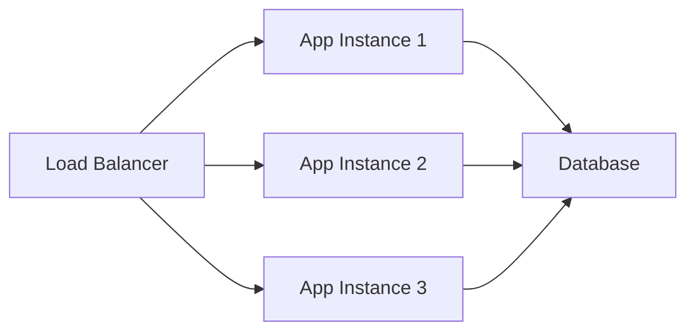

# 🚀 CoderCo Challenge 1: Production Python Service

> **A beginner-friendly guide to building production-ready web services**

Welcome to your first production Python service! This project demonstrates how to build, deploy, and manage a real-world web application that's ready for production use.

---

## 📚 **What You'll Learn**

By studying this project, you'll understand:
- ✅ How web services work in production
- ✅ Python Flask web development
- ✅ Docker containerization
- ✅ Linux service management
- ✅ API design and health monitoring
- ✅ DevOps deployment practices

---

## 🎯 **Project Overview**

This is a **minimal but complete production service** that includes:

| Component | Purpose | Why It Matters |
|-----------|---------|----------------|
| **Flask App** | Web server | Handles HTTP requests and responses |
| **Health Checks** | Monitoring | Tells load balancers if service is working |
| **Docker** | Containerization | Packages app with all dependencies |
| **Systemd** | Service Management | Keeps app running, restarts if it crashes |
| **API Endpoints** | Data Access | Provides programmatic access to service |

---

## 📁 **Project Structure Explained**

```
challenge1-simple/
├── app.py              # Main application (Flask web server)
├── requirements.txt    # Python dependencies list
├── Dockerfile          # Container build instructions
├── docker-compose.yml  # Multi-container orchestration
├── deploy.sh           # Linux deployment automation
└── README.md           # This documentation
```

### 🔍 **Let's Break Down Each File:**

---

## 📋 **File-by-File Explanation**

### 1. 🐍 **`app.py` - The Heart of Our Service**

This is your main application file written in Python using the Flask framework.

**What Flask Does:**
- Creates a web server that listens for HTTP requests
- Routes requests to different functions based on URL
- Returns HTML pages or JSON data as responses

**Key Parts Explained:**

```python
from flask import Flask, jsonify
import time
from datetime import datetime

app = Flask(__name__)  # Creates our web application
```

**Why This Matters:** This line creates your web application object. Think of it as setting up a restaurant - you're creating the establishment that will serve customers (handle web requests).

```python
START_TIME = time.time()  # Records when app started
```

**Why This Matters:** We save the startup time so we can calculate how long the service has been running. This is crucial for monitoring and debugging.

```python
@app.route('/')
def home():
    # Returns the main dashboard HTML
```

**Why This Matters:** The `@app.route('/')` decorator tells Flask "when someone visits the root URL (like http://yoursite.com/), run this function." It's like posting a sign that says "Main Entrance Here."

```python
@app.route('/health')
def health():
    return jsonify({
        "status": "healthy",
        "timestamp": datetime.now().isoformat(),
        "uptime": int(time.time() - START_TIME)
    })
```

**Why This Matters:** Health checks are CRITICAL in production. Load balancers, monitoring systems, and orchestrators use this endpoint to determine if your service is working properly.

**Real-World Example:** 
- AWS Load Balancer hits `/health` every 30 seconds
- If it gets a 200 response, it sends traffic to your server
- If it fails, it stops sending traffic and alerts are triggered

### 2. 📦 **`requirements.txt` - Dependency Management**

```
Flask==2.3.3
```

**What This Does:**
- Lists all Python packages your app needs
- Specifies exact versions for consistency
- Allows anyone to recreate your exact environment

**Why Version Pinning Matters:**
- Flask 2.3.3 vs 3.0.0 might have breaking changes
- Production systems need predictable, stable dependencies
- "It works on my machine" problems are avoided

**Real-World Impact:** Imagine deploying to production and suddenly your app breaks because a dependency updated overnight. Version pinning prevents this nightmare.

### 3. 🐳 **`Dockerfile` - Containerization Magic**

```dockerfile
FROM python:3.11-slim    # Base operating system + Python
WORKDIR /app            # Set working directory inside container
COPY requirements.txt . # Copy dependency list
RUN pip install -r requirements.txt  # Install dependencies
COPY app.py .          # Copy our application
EXPOSE 5000           # Tell Docker this port will be used
CMD ["python", "app.py"]  # Command to start the app
```

**Why Containers Matter:**

| Problem | Solution |
|---------|----------|
| "Works on my laptop but not production" | Container packages EVERYTHING together |
| Different Python versions on servers | Container includes specific Python version |
| Missing system dependencies | Container includes the entire runtime environment |
| Complex deployment process | Single `docker run` command starts everything |

**Real-World Example:** Your laptop has Python 3.12, staging server has 3.10, production has 3.9. Containers ensure your app runs identically everywhere.

### 4. 🎼 **`docker-compose.yml` - Orchestration**

```yaml
services:
  app:
    build: .              # Build from local Dockerfile
    ports:
      - "5000:5000"       # Map container port to host port
    environment:
      - FLASK_ENV=production  # Set environment variables
```

**Why Compose Matters:**
- **Simple deployment:** One command (`docker-compose up`) starts everything
- **Environment consistency:** Same configuration across dev/staging/prod
- **Service networking:** Containers can talk to each other by name
- **Volume management:** Persistent data storage

**Real-World Scaling:**
```yaml
# As your app grows, you might add:
services:
  app:
    # Your Flask app
  database:
    image: postgres:13
  redis:
    image: redis:alpine
  nginx:
    # Reverse proxy
```

### 5. 🚀 **`deploy.sh` - Production Deployment**

This script automates the entire deployment process:

```bash
#!/bin/bash
# Update system packages
sudo apt update && sudo apt upgrade -y

# Install Python 3
sudo apt install -y python3 python3-pip python3-venv

# Create app directory
sudo mkdir -p /opt/coderco-simple

# Set up virtual environment
python3 -m venv venv
source venv/bin/activate
pip install -r requirements.txt

# Create systemd service
sudo tee /etc/systemd/system/coderco-simple.service
```

**Why Automation Matters:**

| Manual Deployment | Automated Deployment |
|-------------------|----------------------|
| ❌ Error-prone (forgot a step?) | ✅ Consistent every time |
| ❌ Takes 30+ minutes | ✅ Takes 2 minutes |
| ❌ Different each time | ✅ Identical process |
| ❌ Hard to document | ✅ Self-documenting code |

**Production Benefits:**
- **Zero-downtime deployments** possible with proper automation
- **Rollback capability** if something goes wrong
- **Audit trail** of what was deployed when
- **Team collaboration** - anyone can deploy the same way

---

## 🔄 **How It All Works Together**

### 🌊 **The Request Flow:**

1. **User visits website** → `http://yourserver.com`
2. **Linux systemd** ensures your service is running
3. **Flask application** receives the HTTP request
4. **Flask routes** determine which function to call
5. **Python function** processes request and generates response
6. **HTTP response** sent back to user's browser
7. **User sees** the beautiful modern dashboard

### 📊 **The Monitoring Flow:**

1. **Load balancer** hits `/health` endpoint every 30 seconds
2. **Flask health function** checks if app is working
3. **JSON response** sent back with status
4. **Load balancer** decides whether to send traffic
5. **Alerts triggered** if health checks fail

---

## 🛠️ **Production Deployment Process**

### **Step 1: Get a Linux Server**
- AWS EC2, DigitalOcean Droplet, or VPS
- Ubuntu 20.04+ or Debian 11+ recommended

### **Step 2: Upload Files**
```bash
# Option A: Git clone
git clone <your-repo>

# Option B: SCP upload
scp -r challenge1-simple/ user@server:/home/user/
```

### **Step 3: Run Deployment**
```bash
cd challenge1-simple
chmod +x deploy.sh
./deploy.sh
```

### **Step 4: Verify It's Working**
```bash
# Check service status
sudo systemctl status coderco-simple

# Test endpoints
curl http://localhost:5000/health
curl http://localhost:5000/api/status

# View logs
sudo journalctl -u coderco-simple -f
```

---

## 🧪 **Development Workflow**

### **Local Development:**
```bash
# Install dependencies
pip install flask

# Run locally
python app.py

# Test endpoints
curl http://localhost:5000/health
```

### **Docker Development:**
```bash
# Build container
docker build -t coderco-app .

# Run container
docker run -p 5000:5000 coderco-app

# Or use compose
docker-compose up --build
```

---

## 🔍 **Understanding Production Concepts**

### **What Makes This "Production-Ready"?**

| Feature | Why It Matters | What Happens Without It |
|---------|----------------|-------------------------|
| **Health Checks** | Load balancers know if service works | Traffic sent to broken servers |
| **Systemd Service** | App restarts if it crashes | Service stays down after crash |
| **Container Deployment** | Consistent environment | "Works on my machine" problems |
| **Error Handling** | Graceful failure responses | Cryptic 500 errors for users |
| **Structured Logging** | Debugging and monitoring | No visibility into problems |

### **Scaling This Service:**



**When you're ready to scale:**
1. **Multiple instances** behind a load balancer
2. **Database** for persistent data
3. **Redis** for caching and sessions
4. **CDN** for static assets
5. **Monitoring** with Prometheus/Grafana

---

## 🎓 **Learning Exercises**

### **Beginner (Modify the existing code):**
1. Add a new endpoint `/api/version` that returns `{"version": "1.0.0"}`
2. Change the dashboard colors to your favorite theme
3. Add a visitor counter that increments each page view

### **Intermediate (Add new features):**
1. Add a `/api/metrics` endpoint with fake CPU/memory data
2. Implement basic logging to a file
3. Add environment variable configuration

### **Advanced (Production improvements):**
1. Add Nginx reverse proxy configuration
2. Implement rate limiting
3. Add SSL/TLS certificate setup
4. Create a proper monitoring dashboard

---

## 🔧 **Troubleshooting Guide**

### **Service Won't Start:**
```bash
# Check service status
sudo systemctl status coderco-simple

# View logs
sudo journalctl -u coderco-simple -n 50

# Check if port is in use
sudo netstat -tlnp | grep 5000
```

### **Can't Access Website:**
```bash
# Check if service is listening
curl http://localhost:5000/health

# Check firewall
sudo ufw status

# Check if Docker container is running
docker ps
```

### **Performance Issues:**
```bash
# Monitor resource usage
htop

# Check application logs
tail -f /var/log/coderco-app.log

# Monitor network connections
sudo netstat -an | grep 5000
```

---

## 📚 **Next Steps in Your DevOps Journey**

### **Immediate Next Skills:**
1. **Nginx** - Reverse proxy and load balancing
2. **PostgreSQL** - Database integration
3. **Redis** - Caching and session storage
4. **SSL/TLS** - HTTPS configuration
5. **Monitoring** - Prometheus and Grafana

### **Advanced DevOps Skills:**
1. **Kubernetes** - Container orchestration
2. **CI/CD Pipelines** - Automated testing and deployment
3. **Infrastructure as Code** - Terraform/Ansible
4. **Monitoring & Alerting** - Complete observability stack
5. **Security** - Secrets management, scanning, hardening

---

## 🌟 **Why This Project Matters**

This isn't just a toy application - it's a **real production service** that demonstrates:

✅ **Industry-standard practices**  
✅ **Scalable architecture patterns**  
✅ **Professional deployment processes**  
✅ **Monitoring and health checks**  
✅ **Container-based deployment**  

**Companies use these exact patterns** to deploy services handling millions of requests. You're learning the real deal!

---

## 🏆 **Congratulations!**

You've just built and deployed a production-ready web service! This is the foundation that scales from a simple Flask app to services handling millions of users.

**You now understand:**
- How web services work in production
- Why containers matter for deployment
- How to monitor service health
- What makes an application "production-ready"
- The fundamentals of DevOps practices

**Keep building, keep learning! 🚀**

---

*Built with ❤️ for the CoderCo Community*
